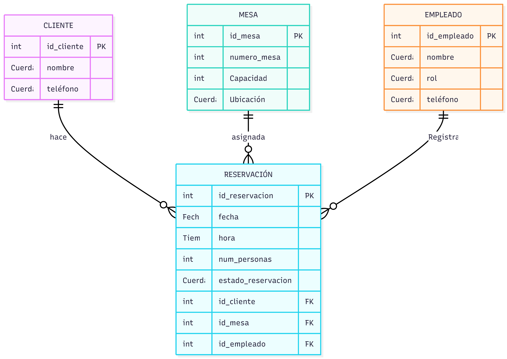

# Base de Datos de Reservaciones para Restaurante

## Descripción General del Proyecto

Este proyecto consiste en el diseño y la documentación de una base de datos relacional para gestionar un sistema de reservaciones de un restaurante. El objetivo del sistema es organizar y almacenar información esencial relacionada con clientes, reservaciones, mesas, pedidos y pagos dentro de un entorno de restaurante.

La base de datos fue diseñada siguiendo principios fundamentales de arquitectura de bases de datos y modelado relacional. A lo largo del desarrollo del proyecto se aplicaron conceptos como el modelado Entidad-Relación, normalización, llaves primarias y foráneas, así como restricciones de integridad de datos.

El propósito principal del sistema es asegurar que las operaciones relacionadas con reservaciones y gestión de clientes dentro de un restaurante puedan almacenarse y consultarse de manera eficiente, manteniendo consistencia y confiabilidad en la información almacenada.

---

## Objetivos del Proyecto

Los objetivos principales de este proyecto son:

- Diseñar una base de datos relacional estructurada para un sistema de gestión de restaurante.
- Aplicar el modelado Entidad-Relación (E-R) para representar las relaciones entre las entidades del sistema.
- Crear un Diccionario de Datos detallado que describa los atributos de cada entidad.
- Implementar restricciones lógicas dentro de la base de datos como Llaves Primarias, Llaves Foráneas, NOT NULL y UNIQUE.
- Aplicar técnicas de normalización (1FN, 2FN y 3FN) para reducir redundancia y mantener la consistencia de los datos.
- Documentar todo el proceso de diseño de forma clara y organizada dentro de un repositorio.

---

## Descripción del Sistema

El sistema de base de datos propuesto se enfoca en gestionar las reservaciones dentro de un restaurante y las operaciones relacionadas con ellas. El sistema permite almacenar y organizar información sobre los clientes que realizan reservaciones, las mesas disponibles dentro del restaurante y los pedidos asociados a dichas reservaciones.

El diseño asegura que cada reservación esté correctamente vinculada con un cliente y con una mesa específica, permitiendo además manejar múltiples reservaciones y mantener registros precisos de la información.

Al estructurar correctamente la base de datos, el sistema evita problemas como información duplicada, datos inconsistentes o registros sin relación dentro de la base de datos.

---

## Componentes del Diseño de la Base de Datos

El proyecto incluye varios componentes clave que representan el proceso de diseño de la base de datos.

### Diagrama Entidad-Relación (ERD)

El diagrama Entidad-Relación representa visualmente las entidades involucradas en el sistema y las relaciones entre ellas. Este diagrama permite entender cómo se estructura la información y cómo interactúan las diferentes partes del sistema.

### Diccionario de Datos

El Diccionario de Datos describe cada tabla de la base de datos, incluyendo:

- Nombre de los atributos  
- Tipos de datos  
- Tamaño de los campos  
- Llaves Primarias (PK)  
- Llaves Foráneas (FK)  
- Permiso de valores nulos  
- Descripción de cada atributo  

Este documento funciona como una referencia para comprender la estructura completa de la base de datos.

### Proceso de Normalización

Durante el diseño de la base de datos se aplicaron reglas de normalización para organizar los datos de forma eficiente. El equipo revisó la estructura de las tablas para asegurar que cumplieran con las siguientes formas normales:

- Primera Forma Normal (1FN)  
- Segunda Forma Normal (2FN)  
- Tercera Forma Normal (3FN)  

Este proceso ayudó a reducir la redundancia y mantener dependencias lógicas correctas entre los datos.

---

## Integrantes del Equipo y Roles

El proyecto fue desarrollado de forma colaborativa por los siguientes integrantes, donde cada uno contribuyó en una parte específica del proceso de diseño de la base de datos:

- **Fernanda** — Analista y Diseñadora (Arquitecta)  
Responsable de explicar la lógica del negocio del sistema y presentar el Diagrama Entidad-Relación.

- **Karen** — Desarrolladora SQL (Constructora)  
Responsable de presentar el Diccionario de Datos y explicar la elección de tipos de datos y restricciones lógicas.

- **Gabriel** — Administrador de Base de Datos (DBA)  
Responsable de explicar la estructura e importancia de las Llaves Primarias (PK) y Llaves Foráneas (FK) para garantizar la integridad de los datos.

- **Alexis** — Query Master y SQL Tester  
Responsable de explicar las dificultades técnicas enfrentadas durante el proceso de normalización y las modificaciones realizadas para mejorar la estructura de la base de datos.

---

## Integración de Inteligencia Artificial

Como parte del proceso de aprendizaje, el equipo interactuó con una inteligencia artificial que actuó como un **“Senior DBA Mentor”**. Esta herramienta fue utilizada como guía para comprender mejor conceptos relacionados con el diseño de bases de datos, sin proporcionar directamente las soluciones completas.

Durante esta interacción, el equipo realizó preguntas relacionadas con:

- Normalización de bases de datos  
- Modelado de relaciones  
- Restricciones de integridad de datos  
- Estructura del diagrama Entidad-Relación  

Las respuestas obtenidas ayudaron al equipo a mejorar sus decisiones de diseño y fortalecer su comprensión de la arquitectura de bases de datos relacionales.

---

## Estructura del Repositorio

```
restaurant-reservations-db
│
├── README.md
│
├── docs
│   ├── user-stories.md
│   └── data-dictionary.docx
│
├── diagrams
│   └── er-diagram-mermaid.md
│
└── assets
    └── er-diagram-image.png
```

---

## Tecnologías y Herramientas Utilizadas

Las siguientes herramientas fueron utilizadas durante el desarrollo de este proyecto:

- GitHub para control de versiones y documentación del proyecto
- Mermaid para la creación del diagrama Entidad-Relación
- Word para el Diccionario de Datos


---

Este proyecto representa una aplicación práctica de los principios de diseño de bases de datos en un escenario relacionado con la gestión de un restaurante. Al seguir metodologías estructuradas de diseño y documentar todo el proceso, el equipo desarrolló un modelo relacional claro y organizado que garantiza consistencia, escalabilidad e integridad de los datos.

El repositorio funciona como un registro del proceso de diseño de la base de datos y demuestra el trabajo colaborativo del equipo al aplicar conceptos teóricos de bases de datos en un sistema práctico.
## Diagrama Entidad-Relación


